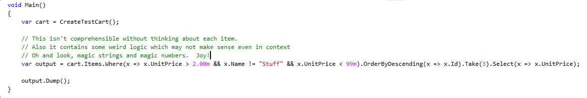
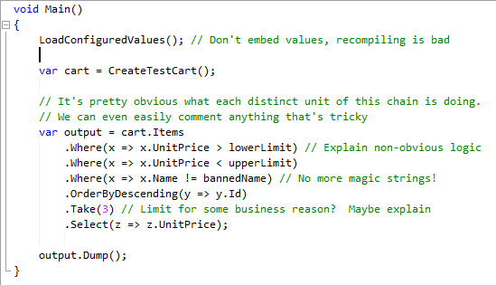
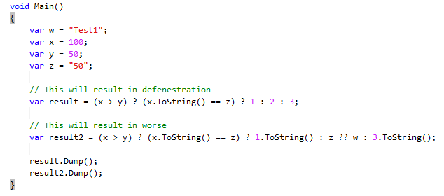

!SLIDE 
# Dev Refresher #

!SLIDE
# TODO #
* Break up long sets of logic into descriptive parts
* Mention nhibernate vs sql + sp.  Mention sql in nhibernate
* Mention statelessness and DI

!SLIDE 
# Readability #

!SLIDE code smaller
# Naming #

    @@@csharp
    // We seem to have standardized on ReSharper's naming

    // Local variables get lowerCamelCase
    var localVariable; 

    // Private instance fields are _lowerCamelCase.
    private string _privateField; 

    // Class level data members get UpperCamelCase.  
    // Use public properties not public fields!
    public ISomeType ClassVariable { get; set; } 

    // Methods and classes are UpperCamelCase
    public void SomeMethod() {}

!SLIDE code smaller
# Logic that can be refactored #
    @@@csharp
    public void ProcessOrder(Order order)
    {
      double minOrderValue = Convert.ToDouble(
          ConfigurationManager.AppSettings["MinOrderValue"]);

      ... 

      if (order.Total < minOrderValue)
      {
        order.IsValid = false;
      }

      ...
      
      FinishProcessingOrder(order);
    }

!SLIDE code smaller
# Cleaner #
    @@@csharp
    public void ProcessOrder(Order order)
    {
      var config = LoadConfiguration();

      ValidateOrder(order, config);
      
      if (order.IsValid)
        FinishProcessingOrder(order, config);
    }

!SLIDE center smbullets

# Guidelines, Not Laws #
* Life is easier if we are all on the same page.
* This is not a one-size-fits-all approach.

!SLIDE center
# Crazy LINQ Chaining Mania #

Insane in da membrain

(Crazy insane, got no brain)

Yes it's a Cyprus Hill reference. No we aren't sorry.

!SLIDE center
# Cleaner LINQ #

!SLIDE center smbullets
## Clever Is Not The Same As Good ##
* Clever solutions to difficult problems are good.
* Clever code to simple problems is bad.  Readability and maintainability are more important than you saving 10 keystrokes.
* If you want to use new technology (and you do), SHARE IT with the team.

!SLIDE center
## Clever And Not Good ##
* We don't write Perl for a reason.  We don't abuse ? and ?? for the same reason.
 

We are aware that not all Perl is hideous.  In theory.

!SLIDE center
## Clever And Not Good ##
* Previous values

result = 2

result2 = "50"

!SLIDE 
# Size and complexity #

* if doesn't fit on your screen completely, it's too long
* if it's so complex that it needs to be tested seperatly, it should be an seperate class -- i.e. don't try to test private methods
* high cyclomatic complexity are candiates for refactoring (too many if's)
* if explaining the method is longer than the method, refactor to
  - name variabling more meaningful
  - add submethod calls that have meaningful names
* if you have to use "and" to describe what a method of class does, split it (i.e. x and y and z) -- move into doing one thing well

!SLIDE 
# Commenting Complexity #

* Empty xml comments are worse than no comments
* Using naming
* use block comments that are meaningful to what is happening - not change logs
* we have SVN history, use it
* Don't preserve old code
* If anyone can't tell what's happen at first glance, needs more comments/better naming/less magic
  - such as we hire a new person, they shouldn't be fumbling for meaning when looking at code
* clever does not mean maintainable

!SLIDE 
# Doing one thing well #

* Type descriptions...
* be able to easily describe any classes in english before you start
  - put in xml comment
* Describe a class' purpose without using "and", should be descriptive and simple to understand exactly what side effects will happen when you use it
* additional side effects mean it doesn't one thing only
* side effects shouldn't exist at the data service level; but at the business logic level
* Isolation should just "happen" and testing shouldn't be "hard"

!SLIDE 
# Clean up after yourself #
# We are not your mom #

* Delete unused code
* remove unneeded comments
* remove unused files from the solution, SVN
* always review and refactor what you have written when it's done to clean up
  - everything can use the extra love
